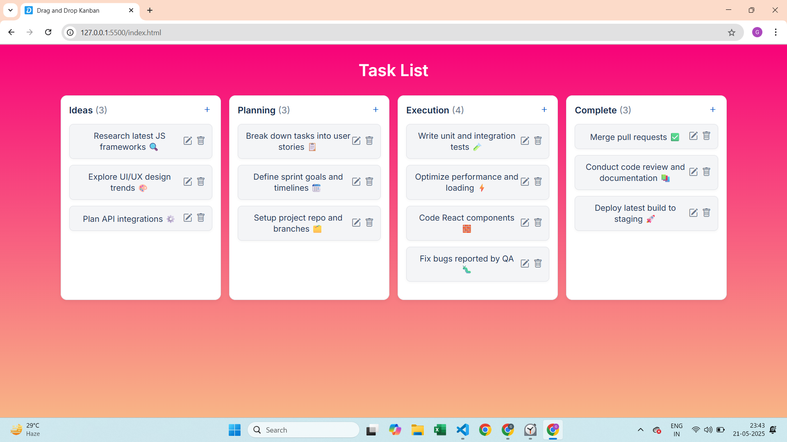

# 🗂️ Drag-and-Drop Kanban Board


This project is a simple Kanban Board web application that helps you organize your tasks by dragging and dropping them between columns: To Do, In Progress, and Done.

---

## 🚀 Features

- 📝 Add new tasks
- ✏️ Edit existing tasks
- 🗑️ Delete tasks
- 📦 Drag & drop between columns 
- 📱 Fully responsive on desktop & mobile 
- 💡 No frameworks or libraries — just vanilla JS

---

## 🧰 Tech Stack

- HTML
- CSS
- JavaScript (Vanilla)

---

## 🌐 Live Demo

👉 [Try It Live](https://mohitgundal.github.io/drag-and-drop-kanban-board/)  

---

## 📸 Screenshot

### 🧱 Kanban Board UI
  

---

## 💻 How to Run Locally

### 1. Clone this repository:

   ```bash
   git clone https://github.com/mohitgundal/drag-and-drop-kanban-board.git
   ```

### 2. Navigate into the project folder:

   ```bash
   cd drag-and-drop-kanban-board
   ```

### 3. Open in browser:

    Simply open `index.html` in your preferred browser (Chrome, Firefox, Edge, etc.)  
   ⚠️ No setup or server required — it's 100% front-end.

---


## 📁 Project Structure
   ```plaintext
/
├── index.html         # Main HTML structure
├── style.css          # Styling and layout
├── script.js          # Drag-drop logic and task handling
├── images/
│   └── kanbanSS.png   # Screenshot image
└── README.md          # This file
```


## 🤝 Contributing
Contributions are welcome!
Feel free to fork the repo, improve the board, and submit a pull request.
Have suggestions or bugs? Open an issue 💡


## 📜 License
This project is licensed under the MIT License. See the LICENSE file for details.


## 🙋‍♂️ Author
Made with 💙 by **Mohit Gundal**  
[](https://www.linkedin.com/in/mohitbuilds/)


## 🙏 Thank you for visiting!
If you liked the project, please consider leaving a ⭐ on the repo 😊
